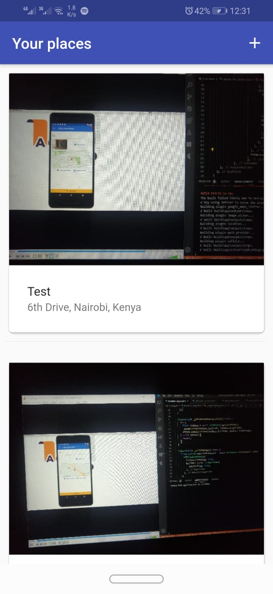
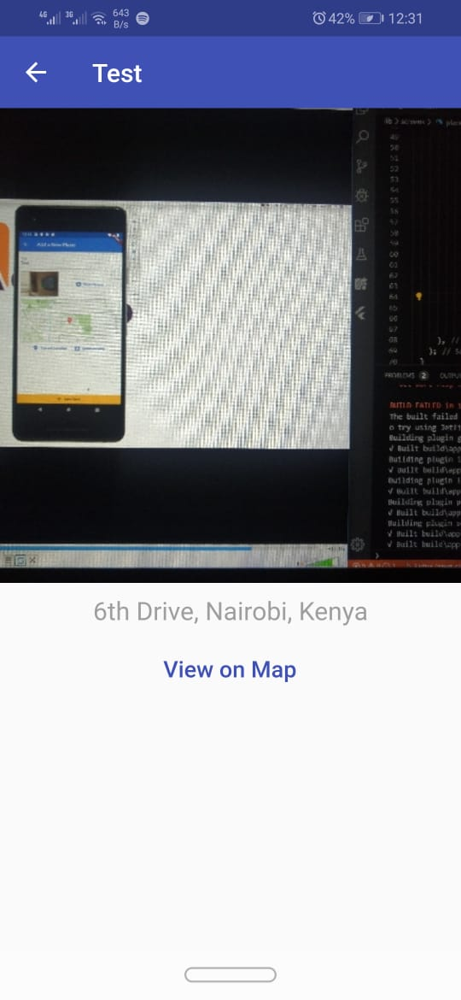
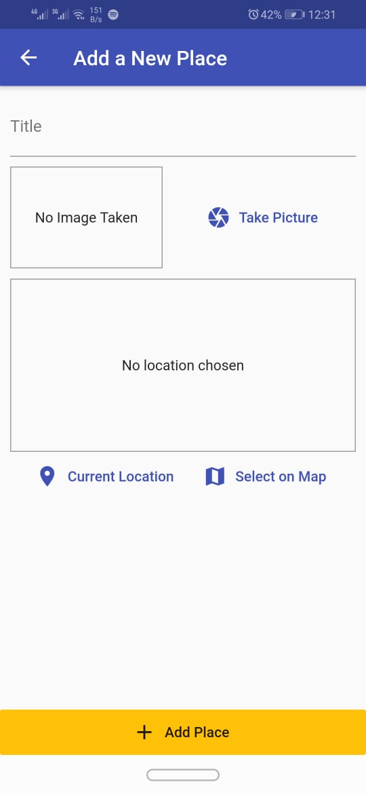
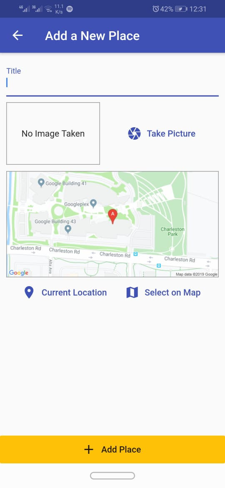
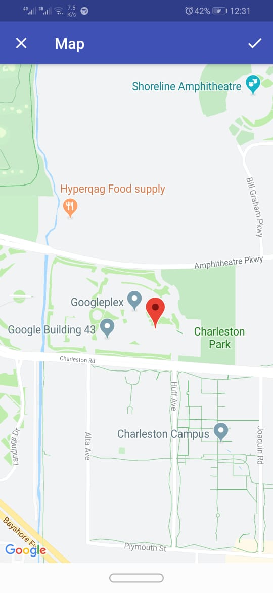

# Great places application

An application that allows for uses to create memories of places they've been. Uses native device features such as the camera to allow a user to take photos, Maps and Location to allow users to fetch information about their current and other locations and finally saves all their data locally.

# Home Page

# Place Detail Page

# Add Place Page

# Current Location Selected

# Select on Map

## Getting Started

This project is a starting point for a Flutter application.

A few resources to get you started if this is your first Flutter project:

- [Lab: Write your first Flutter app](https://flutter.dev/docs/get-started/codelab)
- [Cookbook: Useful Flutter samples](https://flutter.dev/docs/cookbook)

For help getting started with Flutter, view our
[online documentation](https://flutter.dev/docs), which offers tutorials,
samples, guidance on mobile development, and a full API reference.
